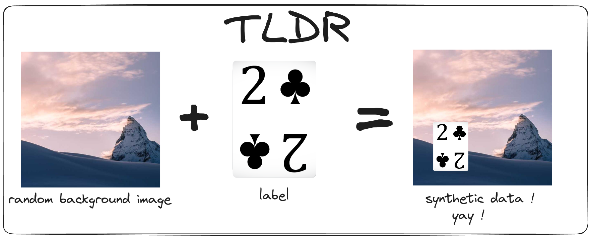

# syth_gen

## explanation

to make our ML models generalize better without having to go out and build a dataset *(cos we lazy)*, this tool can generate synthetic data from labels. simply speaking , this tool overlays a label on top of a random image background that have varying sizes.


## running the tool
you will need: <br>
- `python` (and pip)
- `make`

install dependencies

```bash 
make deps
```

to get random images , you can run the script (in your created venv) 

```bash
python3 download_random.py
# for additonal options run with --help flag
```

then , you can start generating data with

```bash 
python3 generate_data.py --source card --numgen 1  
# for additonal options run with --help flag
```
## todo

- output data in `yolo` txt format 